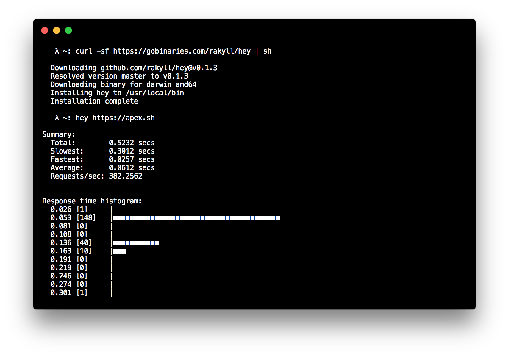

# Go Binaries

[Go Binaries](https://gobinaries.com/) is an on-demand binary server, allowing non-Go users to quickly install tools written in Go without installing `go` itself, and removing the burden of cross-compiling and uploading dozens of binaries for every command-line you write.



## Usage

Install `PKG` with optional semver `VERSION`.

```
curl -sf https://gobinaries.com/<PKG>[@VERSION] | sudo sh
```

Install `PKG` with optional semver `VERSION` to the given directory `PREFIX`. By default `/usr/local/bin` is used.

```
curl -sf https://gobinaries.com/<PKG>[@VERSION] | PREFIX=/tmp sh
```

The `github.com` path prefix is optional. 

## Examples

Install the `hey` HTTP benchmarking tool:

```sh
curl -sf https://gobinaries.com/rakyll/hey | sudo sh
```

Install the `wuzz` HTTP client:

```sh
curl -sf https://gobinaries.com/asciimoo/wuzz | sudo sh
```

Install the latest version of `staticgen`:

```
curl -sf https://gobinaries.com/tj/staticgen/cmd/staticgen | sudo sh
```

Install the latest `1.x` major version of `staticgen`:

```
curl -sf https://gobinaries.com/tj/staticgen/cmd/staticgen@1.x | sudo sh
```

Install the `v1.0.0` version of `triage`:

```
curl -sf https://gobinaries.com/tj/triage/cmd/triage@1.0.0 | sudo sh
```

## Semver support

The following semver patterns are supported:

- Exact version: `v1.2.3`, `1.2.3`
- Wildcards: `v1.x`, `v1.2.x`, `1.x`, `1.2.x`
- Wildcards (implicit): `v1`, `v1.2`, `1.2`
- Leading `v` is optional, regardless of the Git tag

## How does it work?

Take for example you want to install @rakyll's fantastic HTTP benchmarking tool [hey](https://gobinaries.com/rakyll/hey), to install the latest release you would run:

```sh
curl -sf https://gobinaries.com/rakyll/hey | sudo sh
```

This request fetches the latest tag from GitHub and responds with a shell script
which performs a second request, populated with the resolved version and architecture as shown here:

```
https://gobinaries.com/binary/github.com/rakyll/hey?os=darwin&arch=amd64&version=v0.1.3
```

The response of this request is a Golang binary compiled for the requested os, architecture, and package version. The result is cached in a CDN for subsequent requests.


## Limitations

- The Go package must compile in under 100 seconds (CDN limitation)
- The Go package must have at least one Git tag

## FAQ

<details>
  <summary>What's wrong with go-get?</summary>
  Using go-get for installation is fine if you're a Go user, however, if you're creating programs which are designed to be used by a wider audience it's unlikely they will have Go installed.
</details>

<details>
  <summary>Which version of Go is used?</summary>
  Currently Go 1.13.x via the official golang:1.13 Docker image.
</details>

---

[](https://godoc.org/github.com/tj/bins)


## Sponsors

This project is sponsored by my [GitHub sponsors](https://github.com/sponsors/tj) and by [CTO.ai](https://cto.ai/), making it easy for development teams to create and share workflow automations without leaving the command line.

[](https://cto.ai/)